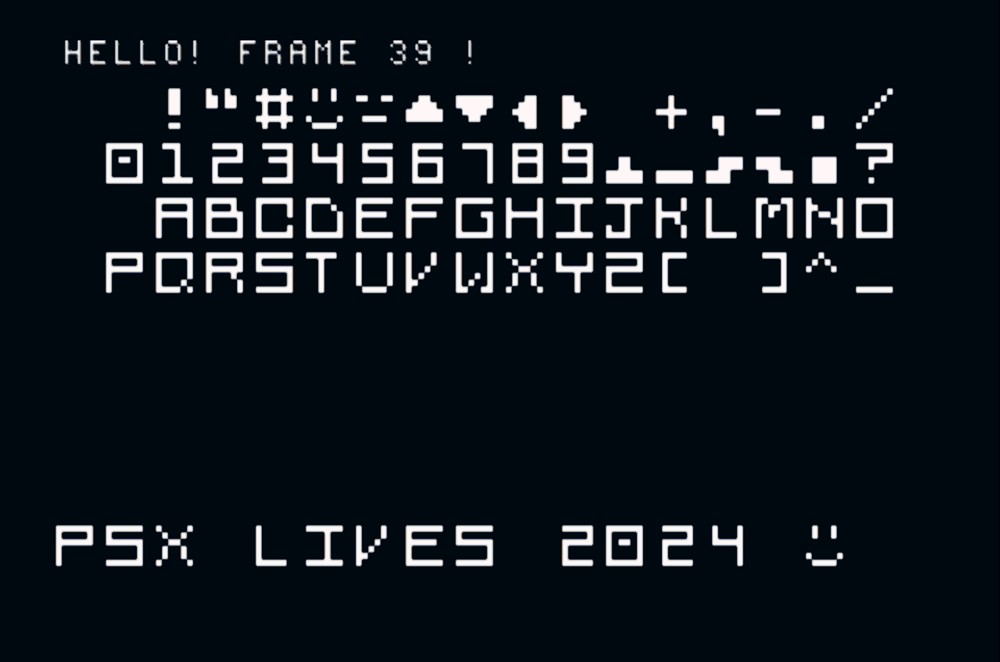

# Notris: a Tetris clone for the PSOne

Notris is a `suspiciously familiar` "tetronimo based game" for the PlayStation 1. It's written in C using PSnoobSDK.

This repo contains builds for three platforms:

- ✅ a JavaScript prototype using `<canvas>`
- ✅ a MacOS C port using SDL
- ✅ a PlayStation 1 game

## Build / play instructions

- Project requires PSnoobSDK, its headers and a C/CMake environment
- `/psx` contains the PSOne game source code
- `build.ps1` is a PowerShell script that runs CMake
- `iso.xml` configures the generated image. You may want to comment out the `<license>` entry (or provide your
  own copy of a `license_data.dat` inside the `psx` folder)
- The generated image will be playable on an emulator or can be burned to a disc

# Notes (WIP)

The following are rough notes that will be written up into a blog post

## Motives and background

Last year I managed to get my hands on a very rare, black PlayStation 1. This is the Net Yaroze and it allowed ordinary
consumers to write their own, basic PSOne games. Yaroze games were a little limited, they had to fit completely within
system RAM, but there sprung up a small yet dedicated fandom of indie developers writing their own PSOne games in the 
1990s.

But now I had my own, and it got me thinking - what does it take to write a PlayStation game?

This is about how I wrote my own, simple Tetris clone for the PSX, using open-source versions of the PSOne SDK but
still running on original hardware and written in 90s-style C. The game is simple, just a 2D puzzle game without any
audio, but I'm proud I made something real and running on an actual PlayStation. [Note - this is written from a future
perspective : D]

## How did they do it in the 90s?

The Sony PlayStation devkit was basically an expansion card you slotted into your PC. It used the old ISA standard and
the software all ran on Windows 95. All the SDKs (software development kits) were based around the C programming language;
almost every PSOne game was written in C.

https://www.retroreversing.com/official-playStation-devkit

Now I came into this project not having ever written any C, and being slightly intimidated by it. Most of my professional
programming experience has been in much higher level languages like JavaScript and Haskell. I'd done a little C++ but
modern C++ is so far from 90s C that they're practically different languages. How would I tackle this project?

## Breaking down the problem

I figured I could break the problem into three smaller steps.

1. Write a prototype in a high level language, to figure out the basic Tetris program
2. Port the prototype to a native PC/Mac game, learning C as I went along
3. Port that C game again to the PSOne, using an open source SDK

## Part 1: JavaScript with HTML5 canvas

I figured the best place to start was a prototype in JavaScript. JS is a very forgiving, concise language, and `<canvas>`
gives us a very basic but accessible graphics API.

Although I was working in JS, I tried to avoid leaning on any higher level language features. I wanted the port to C to
be as straightforward as possible, so I stayed away from any functional programming, object orientation or dynamic typing.
I stuck to a very procedural subset of JS, with mostly static memory.

Writing the prototype took longer than I expected! There's actually some depth to Tetris mechanics, and it took some fair
tweaking before the game felt 'right'. I was pleased with having something playable, but I was a long way from "Notris"
on the PSX.

(You can run the prototype in this project with `yarn dev-web`)

## Part 2: MacOS with C and SDL2

I actually had an ulterior motive in this project: to finally learn C. As someone coming from much higher
level languages I had something of an inferiority complex about it. C has an intimidating reputation and I feared
horror stories of dangling pointers, misaligned bytes and the dreaded segfault.

Actually, working in C was incredibly fun and I really fell in love with the simplicity of its mental model. You
start from basic primitives like structs and bytes and build things up to create an entire working system. A bit
like cooking your own Big Mac from scratch, it feels empowering to know every part of it was your own effort - and
it usually tastes better, too.

The MacOS game took a few days to port, and I was very satisfied with my first C project. And I hadn't had a single
segfault!

SDL2 was pretty easy to work with, but there were a few aspects that required me to allocate memory dynamically.
This would be a no-no on the PlayStation, where the `malloc` provided by the PSX kernel doesn't even work properly.
And the graphics pipeline would be a new experience entirely...

### Running it yourself

`yarn build-macos && yarn run-macos`

We're using SDL2 with the TTF font extension. These need to be installed on the system:

```shell
brew install sdl2 sdl2_ttf
```

Build command is 

```shell
gcc hello.c `sdl2-config --libs` -lm -lSDL2_ttf
```

Explainer for the gcc flags

- subshell for `sdl2-config --libs` generates handy linker arguments `-L/usr/local/lib -lSDL2`
- `-lm` links the math library
- `lX` links a library by name

Set `MallocStackLogging=1` to use `leaks` cmd

Dev notes

- generating tetronimos using numbers
- generating colours using JS

## PlayStation 1

### Setting up dev environment

Compiler etc.
- working on Windows (better emulation options)
- my emulator of choice is Duckstation. It provides some debugging capabilities. The PSX community often recommends no$psx as a dev emulator, but I couldn't get this working
  with my builds.

### `PSn00bSDK`

Rewrite of PSY-Q
Seemed to have the easiest setup & very thorough docs

Requires cmake https://cmake.org/download (I used 3.27.8)
Rest of instructions from https://github.com/Lameguy64/PSn00bSDK
- download binaries for platform, releases here: https://github.com/Lameguy64/PSn00bSDK/releases - I used v0.24
  - downloaded gcc-mipsel-none-elf-12.3.0-windows.zip - this is the MIPS toolchain. Added its /bin to my PATH
  - same dealy with PSn00bSDK-0.24-win32.zip 
  - can check if mkpsxiso (from SDK) and mipsel-none-elf-size (from MIPS toolchain) are recognised on CMD 
- set env var `PSN00BSDK_LIBS` to the libs folder e.g. C:/PSn00bSDK/lib/libpsn00b. Check you can echo `echo %PSN00BSDK_LIBS%` and if not restart shell
- now can invoke compiler with `mipsel-none-elf-gcc`

Then can create project as per https://github.com/Lameguy64/PSn00bSDK/blob/master/doc/installation.md#creating-a-project
Copy template from share\psn00bSDK\template into a new repo
Then call
```
cmake --preset default .
cmake --build ./build
```

To rebuild, clear build dir and re-run commands above

For VSCode, configure the `includePath` in the C/C++ plugin to include `C:\PSn00bSDK/include/libpsn00b` - this enables intellisense for PSX headers

### Showing the PSX logo

Classic PSX games boot in two stages: first they show the Sony Computer Entertainment screen, then the classic PSX logo. But our example project doesn't. Why is that?

Well, the SCEE splash comes from the BIOS, as does the PSX boot sound, but the logo is actually part of the disc license data. It's there to act like a 'seal of authenticity'
in effect.

MKPSXISO supports loading in a license file (i.e. extracted from a retail game via DUMPSXISO), but for the sake of copyright we have to gitignore it.

If we rebuild with a license_data.dat we get the classic splash screen

### Building on windows

Because PSn00bSDK targets windows (and I'm using a windows emulator), I do my scripting for PSX projects with PowerShell. What's the extension of a powershell script?
Why, it's `.ps1`, of course!

There's a `build.ps1` file added to the project that can be executed by right clicking in Explorer

### Programming model

The PSX BIOS and SDKs support heap allocations via `malloc` but are buggy and almost never used.

(add note on vsync)

### Drawing

Setup and text http://lameguy64.net/tutorials/pstutorials/chapter1/1-display.html
Drawing and gfx http://lameguy64.net/tutorials/pstutorials/chapter1/2-graphics.html

Basic idea is that the 3D maths, projections etc are handled by a coprocessor called the Geometry Transform Engine, before
the CPU sends "packets" to the GPU to actually go and render / rasterise primitive shapes at particular locations.

Packets are arranged in RAM using an ordering table. This initialises to a simple linked list of n pointers. Primitives are added by inserting structs into the linked list

See https://psx.arthus.net/sdk/Psy-Q/DOCS/TECHNOTE/ordtbl.pdf

```
IN ARRAY:

[Front of screen], z= 0, z=1, z=2, ... [Back of screen]

LINKED LIST:

0 --                -- 1 <--                                -- 2 <-- BEGINS FROM END 
    \- [Shape 1] <-/         \- [Shape 2] <-- [Shape 3] <--/
```

The ordering table is a reverse linked list. In memory it starts with the packets to display at the front of the screen, and ends with those furthest back, so that the
index in the list is analogous to a z-index. However it is processed back-to-front to implement the "painter's algorithm". When the ordering table is ready it is processed
with `DrawOTag()` passing the _last_ element.

Because primitives need to live longer than the functions that declare them, they need to be initialised in a global buffer instead of the stack. (Otherwise functions 
returning / entering would overwrite the stack memory).

Each primitive can be between 3 to 13 words (each word is 4 bytes as the PSX is 32 bit). Generally the primitive buffers can just be declared as arrays of `char` and
then the programmer uses `sizeof` and pointer arithmetic to work with the memory. The SDK I'm using provides several macros to help with setting up primitives.

Generally two ordering tables and primitive buffers are kept in memory, for the same reason two graphics buffers support performance. One set primitives / linked list 
can be drawn whilst the other is being prepared for the next frame.

### Displaying text

There is a simple debug text font, but it looks very rough and basic. Instead I opted to create a TIM format texture from some PNG pixel art. I wasn't completely happy 
with how this looked, but I didn't want to focus all my energy on just displaying text.

You can see the debug and TIM fonts in the image below:



### Displaying a play piece

todo - polygonal graphics, gourad shading

### Controller input

PSOne controllers are somewhat complex. There are many types (lightguns, mice, analog, digital, multitaps) and a mixture of APIs for accessing them. For most purposes it's 
fine to use PSNoobSDK's `StartPAD` and `InitPAD` functions. These will poll the controllers every frame (vsync) and copy state into a buffer you provide. The actual button 
data is provided as a map of 16 bits, though curiously the bits are all inverted (i.e. they're 1 when unpressed)

```c
// 2x ports, 34 bytes for each (each port may have a 4 controller multitap)
char joypads[2][34];

// Tell BIOS to pass data into these buffers
InitPAD(joypads[0], 34, joypads[1], 34);

// Poll every vsync
StartPAD();

// Handle PSX kernel bug where StartPAD() blocks VSync() due to re-enabling vsync interrupts
ChangeClearPAD(1);

while (true) {
  // ...Somewhere in render loop

  // Check joy 1 connected
  if (joypads[0][0] == 0) {
    // Use PSNoobSDK PADTYPE for convenience
    p_pad = (PADTYPE*) joypads[0];

    // Check digital pad
    if (p_pad->type == 0x04) {
      // Button bits are inverted
      uint16_t pressed = ~ (p_pad->btn);

      // Mask bits to get pressed buttons
      if (pressed & PAD_CIRCLE) {
        printf("You pressed Circle!\n");
      } else {
        // et cetera
      }
    }
  }
}
```

### Creating a UI

### Porting the game code

### Everything together

### Running on PlayStation
