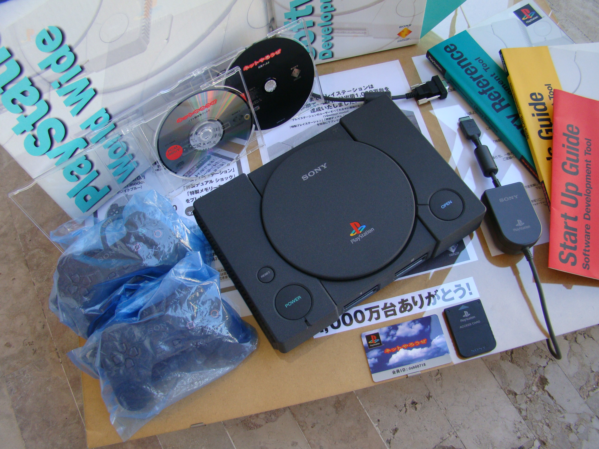
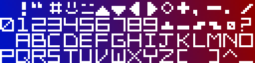
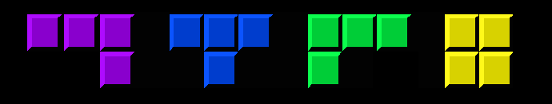

# Notris: a Tetris clone for the PlayStation 1

Notris is a homebrew PSX game, written in C using modern tooling. It's fully playable on original hardware and is
powered by [PSNoobSDK](https://github.com/Lameguy64/PSn00bSDK).


View the PSX codebase [here](psx).

## Why write a PSX game in 2024?

Last year I got my hands on a rare, black PlayStation 1. This is called a Net Yaroze and is a special console that can
play homebrew games as well as ordinary PSX titles. It was part of a special Sony project to get hobbyists and students
into the games industry.

<p align="center">
  
</p>

Yaroze games were very limited, as Sony didn't want bedroom coders competing with commercial developers. They could only
be played on other Yarozes or on [special demo discs](https://www.breck-mckye.com/blog/2016/11/net-yaroze/). They had to
fit entirely within system RAM without access to the CD-ROM. Despite these limitations, the Yaroze fostered a passionate
community of indie developers.

And now I had my own. Which got me thinking: what was it actually like, to write a PlayStation game?

This is about how I wrote a simple homebrew PSX game myself, using an open-source version of the libraries but still
running on original hardware and written in classic C.

## PlayStation development in the 1990s

[Skip this section](#writing-my-own-psx-game)

PSX games were typically written in C on Windows 9X workstations. The official devkit was a pair of ISA expansion cards
that slotted into a common IBM PC motherboard and contained the entire PSX system chipset, video out, and extra RAM (8mb
instead of 2mb). This provided TTY and debugger output to the host machine.

<p align="center">
  
</p>

You might have heard about blue PlayStations. These were for QA rather than development and are identical to retail
units except that they can play burned CD-ROMs. However, at least one company sold a special addon to convert them into
devkits:

<p align="center">
  
</p>

The design was very developer-friendly. You could play your game on CRT with normal controllers whilst stepping through
GDB breakpoints on your Windows 95 PC, leafing through a thick textbook of C SDK functions.

In principle, a PSX developer could work entirely in C. The SDK comprised a set of C libraries called PSY-Q, and
included a compiler program `ccpsx` that was really just a frontend over GCC. This supported a range of optimisations, 
like code inlining and loop unrolling, although performance critical sections still warranted hand-optimised assembly.

(You can read about those optimisation in [these SCEE conference slides](https://psx.arthus.net/sdk/Psy-Q/DOCS/CONF/SCEE/96April/optimize.pdf)).

<p align="center">
  
</p>

C++ was supported by `ccpsx` but had a reputation for generating 'bloated' code, as well as slower compile times.
Really, C was the lingua franca of PSX development, but some projects made use of dynamic scripting languages on top of 
a base engine. For example, _Metal Gear Solid_ used TCL for level scripting; and the _Final Fantasy_ games went some
ways further and implemented their own bytecode languages for battles, field and minigame systems. (You can learn more about 
this [here](https://youtu.be/S-8PVydb9CM?si=oU0Rqy6bsd0EVq_F)).

(_For further reading take a look at https://www.retroreversing.com/official-playStation-devkit_)

## Writing my own PSX game

[Skip this section](#hello-psx)

But I came to this from a very different perspective: a software engineer in 2024 who mostly worked on web applications.
My professional experience had almost exclusively been in high level languages like JavaScript and Haskell; I'd done a
little OpenGL work and C++, but modern C++ is almost a completely different language to C.

I knew PSX SDKs existed for languages like Rust, but I wanted to experience the flavour of 'real' PSX programming, the 
way it had been done back in the 90s. So it would be modern toolchains and open source libraries, but C all the way
through.

The game needed to be something 2D that could be prototyped in a couple of days. I settled for a Tetris clone - I 
figured that would be complex _enough_ to experience what I wanted to.

### Prototyping in JavaScript

The first step was to build a prototype in a familiar technology. This would allow me to nail down the basic design,
then the logic could be translated piecemeal into C.

As a web developer the most obvious technology for prototyping was JavaScript: it's simple, concise, easy to debug, and
it sports the HTML5 `<canvas>` graphics API. "Notris" came together very quickly

<p align="center">
  
</p>

At the same time, I was wary that more high-level JavaScript features would be difficult to port. Anything using
classes or closures would need to be completely rewritten, so I was careful to restrict myself to a simple, procedural
subset of the language.

### Learning C!

Now, I actually had an ulterior motive taking on this project: it was an excuse to finally learn C. The language loomed
large in my mind and I'd begun to develop an inferiority complex over not knowing it.

C has an intimidating reputation and I feared horror stories of dangling pointers, misaligned reads and the dreaded
`segmentation fault`. More precisely: I was worried that if I tried to learn C, and failed, I'd discover
that I wasn't actually a very good programmer after all.

To keep things easy I figured I could use [SDL2](http://www.libsdl.org/) to handle the input and graphics, and compile for my desktop 
environment (MacOS). That would give me a fast build / debug cycle and make the learning curve as gentle as possible.

Despite my fears, I found C incredibly fun. Very quickly it 'clicked' for me. You start from very simple primitives - 
structs, chars, functions - and build them up into layers of abstraction to eventually find yourself sat atop an entire 
working system.


"Notris" only took a couple of days to port, and I was very satisfied with my first true C project. And I hadn't had a
single segfault!

SDL had been a pleasure to work with, but there were a few aspects that required me to allocate memory dynamically.
This would be a no-no on the PlayStation, where the `malloc` provided by the PSX kernel doesn't work properly. And the 
graphics pipeline would be an even bigger leap...

## Hello PSX!

When it comes to PlayStation homebrew there are two major choices for your SDK. Either:

1. The original **Psy-Q** library with a modernised toolchain ("Nugget")
2. The new **PSNoobSDK** which is open source

There are a couple of other options like the C++ **Psy-Qo**, and you can even forgo any SDK just to do memory-mapped I/O
yourself - but I was not brave enough for that.

The biggest issue with Psy-Q is that it's still Sony proprietary code, even 30 years later. Legally, any homebrew built
with it is at risk. That is what sunk the [Portal64](https://github.com/Valkirie/portal64) demake: it statically linked `libultra`, which is Nintendo's
proprietary N64 SDK.

But to be honest, the main reason I chose [PSNoobSDK](https://github.com/Lameguy64/PSn00bSDK) was that it's very well 
documented and simple to set up. The API is _very_ similar to Psy-Q: in fact for many functions I could just consult the
printed references that came with my Yaroze.

If me using a non-authentic SDK offends the PSX purist in you, feel free to quit reading now in disgust.


My first task was a kind of hello world: two squares on a coloured background. Sounds simple, right?

## A primer on PSX graphics

[Skip this section](#show-me-some-code)

(*Some of this is simplified. For a more authoritative guide read the [PSNoobSDK tutorial](http://lameguy64.net/tutorials/pstutorials/chapter1/1-display.html))

To start with, think of the PSX VRAM as a big 1024 by 512 canvas of 16-bit pixels. Altogether that makes 1 megabyte of 
memory shared by framebuffers and textures. We can choose the resolution of the output framebuffer - even up to 640x480 
pixels if we're greedy - but more resolution = fewer textures.

<p align="center">
  
</p>

Most PSOne games (and... games generally) have a notion of dual-buffered rendering: whilst one frame is being prepared,
the other is sent to screen. So we need to allocate two frame buffers:

<p align="center">
  
</p>

(Now you can see why 640x480 isn't practical - there isn't enough space for two 480p buffers. But this mode CAN be used
by things like the PSX startup logo, which doesn't need much animation)

The buffers (referred to alternately as display and draw environments) are swapped every frame. Most PSX games target 
30fps (in North America) but the actual VSync interrupt comes at 60hz. Some games manage to run at full 60 fps - Tekken
3 and Kula World (Roll Away) come to mind - but obviously then you need to render in half the time. Remember we only
have 33 Mhz of processing power.

### Shapes to screen

But - how does the drawing process work? This is done by the GPU, but the PSX GPU works very differently to a modern
graphics card. Essentially, every frame the GPU is sent an ordered list of graphics 'packets' or commands. "Draw a
triangle here", "load this texture to skin the next quad", et cetera.

The GPU does not do 3D transformations; that is the job of the GTE (Geometry Transform Engine) coprocessor. The GPU 
commands represent purely 2D graphics, already manipulated by 3D hardware.

That means the path of a PSX pixel goes as follows:


1. The program on the CPU creates the primitive (e.g. a textured triangle)
2. (Optionally) the GTE does 3D maths / transformations on the primitive
3. These primitives / packets are linked into an 'ordering table'
4. An SDK function goes through the ordering table and sends the packets to the GPU
5. The GPU processes the packets / commands from a FIFO queue
6. The GPU outputs VRAM pixels (rasterisation)
7. The framebuffers are swapped and the displayEnv is set
8. Video output hardware scans lines from the raster into a video signal
9. Your (analog) TV turns lines into an electron scanning beam! Coloured dots of phosphor glow!

So in pseudocode the PSX frame loop (basically) goes like this

```
FrameBuffer [0, 1]
OrderingTable [0, 1]

id = 1 // flips every frame

loop {
  // Game logic

  // Construct the next screen by populating the current ordering table
  MakeGraphics(OrderingTable[id])
  
  // Wait for last draw to finish; wait for vertical blank
  DrawSync()
  VSync()
  
  // The other frame has finished drawing in background, so display it
  SetDisplay(Framebuffer[!id])
  
  // Start drawing current frame
  SetDrawing(Framebuffer[id])
  
  // Send ordering table contents to GPU via DMA
  Transfer(OrderingTable[id])

  // Flip
  id = !id
}
```

You can see from this that whilst frame 1 is on-screen, frame 2 is still being painted, and frame 3 is potentially still
being 'constructed' by the program itself. Then after DrawSync / VSync we send frame 2 to the TV, and get the GPU
drawing frame 3.


### Ordering tables and z-indexes

As mentioned, the GPU is a completely 2D piece of hardware, it doesn't know about z-coordinates in 3D space. There is no
"z-buffer" to describe occlusions - i.e. which objects are in front of others. So how are items sorted in front of 
others?

The way it works is that the ordering table comprises a reverse-linked chain of graphics commands. These are traversed
back-to-front to implement the **painter's algorithm**.


To be precise, the ordering table is a reverse-linked list. Each item has a pointer to the previous item in the list, 
and we add primitives by inserting them into the chain. Generally OTs are initialised as a fixed array, with each
element in the array representing a 'level' or layer in the display. OTs can be nested for implementing complex scenes.

The following diagram helps explain it ([source](https://psx.arthus.net/sdk/Psy-Q/DOCS/TECHNOTE/ordtbl.pdf))


This approach isn't perfect and sometimes PSX geometry shows weird clipping, because each poly can only be at a single
'z index' in screen space, but it works well enough for most games. These days such limitations are considered part of 
the PSX's distinctive charm.

## Show me some code!

[Skip this section](#back-to-the-project)

We've talked a lot of theory - what does this look like in practice?

This section won't go through all the code line-by-line but should give you a taster for PSX graphics concepts. If you
want to see full code go to 👉 [`hello-psx/main.c`](hello-psx/main.c).

Alternatively if you're not a coder, feel free to skip ahead. This is just for techies who are curious.

The first thing we need are some structs to contain our buffers. We will have a `RenderContext` that contains two
`RenderBuffers`, and each `RenderBuffer` will contain:

- a `displayEnv` (specifies VRAM area of current display buffer)
- a `drawEnv` (specifies VRAM area of current draw buffer)
- an `orderingTable` (reverse linked list that will contain pointers to graphics packets)
- a `primitivesBuffer` (structs for graphics packets / commands - including all the polygons)

```c
#define OT_SIZE 16
#define PACKETS_SIZE 20480 

typedef struct {
  DISPENV displayEnv;
  DRAWENV drawEnv;
  uint32_t orderingTable[OT_SIZE];
  uint8_t primitivesBuffer[PACKETS_SIZE];
} RenderBuffer;

typedef struct {
  int bufferID;
  uint8_t* p_primitive; // next primitive
  RenderBuffer buffers[2];
} RenderContext;

static RenderContext ctx = { 0 };
```

Every frame we will invert the `bufferID` which means we can seamlessly work on one frame whilst the other is being
displayed. A key detail is that the `p_primitive` is constantly kept pointed at the next byte in the current
`primitivesBuffer`. It is **imperative** that this is incremented every time a primitive is allocated and reset at the 
end of every frame.

Pretty much before anything we need to set up our display and draw environments, in reverse configuration so that
`DISP_ENV_1` uses the same VRAM as `DRAW_ENV_0`, and vice versa

```c
//                        x  y   width height
SetDefDispEnv(DISP_ENV_0, 0, 0,   320, 240);
SetDefDispEnv(DISP_ENV_1, 0, 240, 320, 240);

SetDefDrawEnv(DRAW_ENV_0, 0, 240, 320, 240);
SetDefDrawEnv(DRAW_ENV_1, 0, 0,   320, 240);
```

I am being quite condensed here - but from here every frame basically goes like

```c
while (1) {
  // do game stuff... create graphics for next frame...

  // at the end of loop body
  
  // wait for drawing to finish, wait for next vblank interval
  DrawSync(0);
  VSync(0);

  DISPENV* p_dispenv = &(ctx.buffers[ctx.bufferID].displayEnv);
  DRAWENV* p_drawenv = &(ctx.buffers[ctx.bufferID].drawEnv);
  uint32_t* p_ordertable = ctx.buffers[ctx.bufferID].orderingTable;
  
  // Set display and draw environments
  PutDispEnv(p_dispenv);
  PutDrawEnv(p_drawenv);
  
  // Send ordering table commands to GPU via DMA, starting from the end of the table
  DrawOTagEnv(p_ordertable + OT_SIZE - 1, p_drawEnv);
  
  // Swap buffers and clear state for next frame
  ctx.bufferID ^= 1;
  ctx.p_primitive = ctx.buffers[ctx.bufferID].primitivesBuffer;
  ClearOTagR(ctx.buffers[0].orderingTable, OT_SIZE);
}
```

This might be a lot to take in. Don't worry.

<p align="center">
  
</p>

If you really want to understand this, the best thing is to take a look at [`hello-psx/main.c`](hello-psx/main.c).
Everything is commented in a fair amount of detail. Alternatively, go through the
[PSNoobSDK tutorial](http://lameguy64.net/tutorials/pstutorials/)... it's pretty terse and quite clearly written.

Now... how do we draw stuff? We write structs into our primitives buffer. This buffer is typed as just a big ole list of 
`chars` so we cast into our shape / command struct, then advance the primitives buffer pointer using `sizeof`:

```c
// Create a tile primitive in the primitive buffer
// We cast p_primitive as a TILE*, so that its char used as the head of the TILE struct
TILE* p_tile = (TILE*)p_primitive;
setTile(p_tile); // very very important to call this macro
setXY0 (p_tile, x, y);
setWH  (p_tile, width, width);
setRGB0(p_tile, 252, 32, 3);
  
// Link into ordering table (z level 2)
int z = 2;
addPrim(ordering_table[buffer_id] + z, p_primitive);

// Then advance buffer
ctx.p_primitive += sizeof(TILE);
```

We just inserted a yellow square! 🟨 Try to contain your excitement.

## Back to the project

[Skip this section](#building-and-running)

At this point in my journey all I really had was a "hello world" demo program, with basic graphics and controller input.
You can see from the code in [`hello-psx`](hello-psx) that I was documenting as much as possible, really for my own
benefit. A working program was a positive step but not a real game.


It was time to _get real_.

### Displaying text

Any Tetris game needs to show the score.

The PSX doesn't really give you much in the way of text rendering. There is a debug font (shown above) but it's extremely
basic - for development and not much else.

Instead, we need to create a font texture, and use that to skin quads. I created a monospace font with https://www.piskelapp.com/
and exported that as a transparent PNG:



PSX textures are stored in a format called TIM. Each TIM file comprises:

- a raster image (uncompressed) in 4, 8, 16 or 24 bits per pixel
- a colour lookup table (CLUT) that acts like the texture's palette
- coordinates for loading into VRAM

Because the VRAM location of the texture is 'baked into' the TIM file, you need a tool to  manage your texture 
locations. I recommend https://github.com/Lameguy64/TIMedit for this.

From there we just have a function to skin a bunch of quads, with the UV offsets based on each ASCII value.

### The play frame

We need a space for the pieces to fit into. It would be easy to use a boring white rectangle for this, but I wanted
something that felt more... PlayStation


Our user interface is coming together. What about the pieces?

### Tetronimos (Notronimos?)

Tetris is called Tetris because each piece is made of four bricks, and `tetra` is four in Greek. Ideally each brick
should be visually distinct with sharp, shaded edges. We do this with two triangles and a quad:



At 1x native resolution the effect would be less clear, but it still looks nice and chunky:


In the first prototype of my game I implemented a full naive rotation system, that would actually flip the block 90
degrees on a centre point. It turns out that isn't actually a great approach, because it causes the blocks to
'wobble', shifting up and down as they rotate:


Instead, the rotations are hardcoded to be 'nice' instead of 'accurate'. A Tetronimo is a grid of 4x4 cells, and
each cell can be filled or unfilled. There are 4 rotations. Therefore: rotations can just be arrays of four 16-bit 
numbers. Which looks like this:

```c
/**
 * Example: T block
 *
 * As a grid:
 *
 * .X.. -> 0100
 * XXX. -> 1110
 * .... -> 0000
 * .... -> 0000
 * 
 * binary      = 0b0100111000000000
 * hexadecimal = 0x4E00
 * 
 */

typedef int16_t ShapeBits;

static ShapeBits shapeHexes[8][4] = {
  { 0 },                              // NONE
  { 0x0F00, 0x4444, 0x0F00, 0x4444 }, // I
  { 0xE200, 0x44C0, 0x8E00, 0xC880 }, // J
  { 0xE800, 0xC440, 0x2E00, 0x88C0 }, // L
  { 0xCC00, 0xCC00, 0xCC00, 0xCC00 }, // O
  { 0x6C00, 0x8C40, 0x6C00, 0x8C40 }, // S
  { 0x0E40, 0x4C40, 0x4E00, 0x4640 }, // T
  { 0x4C80, 0xC600, 0x4C80, 0xC600 }, // Z
};
```

Extracting the cell values is just a case of simple bit masking:

```c
#define GRID_BIT_OFFSET 0x8000;

int blocks_getShapeBit(ShapeBits s, int y, int x) {
  int mask = GRID_BIT_OFFSET >> ((y * 4) + x);
  return s & mask;
}
```

Things are coming together now with momentum.

### A title screen

It was at this point I hit a snag: randomisation. Tetronimos have to appear in a random fashion in order for the game to
be worth playing, but randomisation is hard with computers. On my MacOS version, I was able to 'seed' the random number
generator with the system clock, but the PSX doesn't have an internal clock.

Instead, a solution many games take is to make the player create the seed. The game displays a splash or title screen with
text like 'press start to begin', and then the timing is taken from that button press to create the seed.

I created a 'graphic' by declaring some binary-encoded `int32`s where each `1` bit would be a 'pixel' in a row of
bricks:


What I wanted was for the lines to gradually dissolve into view. First I needed a function that would effectively 'keep
track' of how many times it was called. C makes this easy with the `static` keyword - if used inside a function, the same
memory address and contents are re-used on the next invocation.

Then inside this same function is a loop that goes through the x/y values of the 'grid', and decides whether enough
ticks have happened to show the 'pixel':

```c
void ui_renderTitleScreen() {
  static int32_t titleTimer = 0;
  titleTimer++;
  
  // For every 2 times (2 frames) this function is called, ticks increases by 1
  int32_t ticks = titleTimer / 2;
  
  // Dissolve-in the title blocks
  for (int y = 0; y < 5; y++) {
    for (int x = 0; x < 22; x++) {
      int matrixPosition = (y * 22) + x;
      if (matrixPosition > ticks) {
        break; // because this 'pixel' of the display is not to be displayed yet
      }
    
      int32_t titleLine = titlePattern[y];
      int32_t bitMask = titleMask >> x;
      if (titleLine & bitMask) { // there is a 'pixel' at this location to show
        ui_renderBlock( /* skip boring details */);
      }
    }
  }
}
```

We're _almost_ there now.


### Adding the SCEA logo

Classic PSX games boot in two stages: first the Sony Computer Entertainment screen, then the PSX logo. But if we compile
and run the `hello-psx` project it doesn't. The second screen is just black. Why is that?


Well, the SCE splash comes from the BIOS, as does the PSX boot sound, but the famous logo is actually part of the disc 
license data. It's there to act like a 'seal of authenticity' - so anyone pirating a game is copying _Sony's_ IP as well
as the publisher's. This gave Sony more legal instruments to crack down on software piracy.

If we want _our_ game to show the logo, we need to provide a license file extracted from an ISO, but for the sake of 
copyright we have to `.gitignore` it. 

```xml
<license file="${PROJECT_SOURCE_DIR}/license_data.dat" />
```

Okay. _Now_ we are ready.

## The moment of truth

This all started with an impulse purchase, my black Yaroze PlayStation. Ironically it wouldn't actually be playing my 
game as it still possessed its anti-piracy hardware. I didn't fancy installing a modchip on such a priceless piece of 
PSX history - not with my soldering skills.

Instead, I had to track down a modded grey PlayStation, one that still had a decent drive. I figured that the point of 
my project was to write a _true_ PlayStation game and that meant using a _true_ PlayStation.

I also had to find the right media. The PSX laser is quite picky and modern CD-Rs tend to be much less reflective than
pressed discs. My first attempts with grocery story CDs were a waste of time, and over the space of about two weeks I
created a lot of coasters.

This was a dark moment. Had I gotten all this way, only to fail at _burning the CD_?

After several weeks I got my hands on some special JVC Taiyo Yuden stock. From what I could read these were quite
specialist, and typically used in industrial applications. I burned the first disc in the platter and I expected the
worst.

[This was the moment of truth:](https://www.youtube.com/watch?v=oNlyFrWR-t0)
<div align="center" style="position: relative">
      <a href="https://www.youtube.com/watch?v=oNlyFrWR-t0">
         
      </a>
</div>

The PlayStation boot sequence boomed from my tiny monitor speakers and the classic "PS" logo splashed across the screen
in vibrant 640-by-480 resolution. The BIOS had clearly found _something_ on that disc, but a lot could fail after this
point. The screen fell black and I strained my ears for the telltale _click-click-click_ of a drive error.

Instead, one by one, little coloured squares began to blink in from the darkness. Line by line they spelled out a word:
`NOTRIS`. Then: `PRESS START TO BEGIN`. The text beckoned at me. What would happen next?

A game of Tetris, of course. Why was I surprised? **Writing your own PlayStation game in C is actually very simple: all 
it requires is to make no mistakes whatsoever**. That is computing for you, especially the low level stuff. It is hard,
and sharp, and it is beautiful. Modern computing has softer edges but the essentials haven't changed.

Those of us who love computers need to have something slightly wrong with us, an irrationality to our rationality, a 
way to deny all the evidence of our eyes and ears that the hostile box of silicon is dead and unyielding. And fashion by 
cunning machinery the illusion that it lives.
