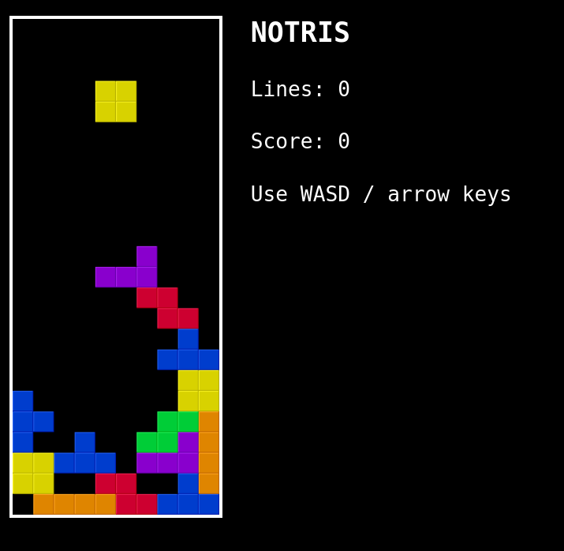

# Notris: a Tetris clone for the PlayStation 1

Notris is a modern homebrew PSX game written in C using modern tooling. It's fully playable on original hardware and is
powered by [PSNoobSDK](https://github.com/Lameguy64/PSn00bSDK).

(picture)

- [Skip the introduction, go to the technical stuff](#hello-psx)
- [View code]

## Why write a PSX game in 2024?

Last year I got my hands on a rare, black PlayStation 1. This is called a Net Yaroze and is a special console that can
play homebrew games as well as ordinary PSX titles. It was part of a special Sony project to get hobbyists and students
into the games industry.

<p align="center">
  
</p>

Yaroze games were very limited, as Sony didn't want bedroom coders competing with commercial developers. They could only
be played on other Yarozes or on [special demo discs](https://www.breck-mckye.com/blog/2016/11/net-yaroze/). They had to
fit entirely within system RAM without access to the CD-ROM. Despite these limitations, the Yaroze fostered a passionate
community of indie developers.

And now I had my own. It got me thinking: what was it actually like, to write a PlayStation game?

This is about how I wrote a simple homebrew PSX game myself, using an open-source version of the libraries but still
running on original hardware and written in classic C.

## PlayStation development in the 1990s

PSX games were typically written in C on Windows 9X workstations. The official devkit was a pair of ISA expansion cards
that slotted into a common IBM PC motherboard and contained the entire PSX system chipset, video out, and extra RAM (8mb
instead of 2mb). This provided TTY and debugger output to the host machine.

<p align="center">
  
</p>

You might have heard about blue PlayStations. These were for QA rather than development and are identical to retail
units except that they can play burned CD-ROMs. However, at least one company sold a special addon to convert them into
devkits:

<p align="center">
  
</p>

The design was very developer-friendly. You could play your game on CRT with normal controllers whilst stepping through
GDB breakpoints on your Windows 95 PC, leafing through a thick textbook of C SDK functions.

In principle, a PSX developer could work entirely in C. The SDK comprised a set of C libraries called PSY-Q, and
included a compiler program `ccpsx` that was really just a frontend over GCC. This supported a range of optimisations, 
like code inlining and loop unrolling, although performance critical sections still warranted hand-optimised assembly.

(You can read about those optimisation in [these SCEE conference slides](https://psx.arthus.net/sdk/Psy-Q/DOCS/CONF/SCEE/96April/optimize.pdf)).

<p align="center">
  
</p>

C++ was supported by `ccpsx` but had a reputation for generating 'bloated' code, as well as slower compile times.
Really, C was the lingua franca of PSX development, but some projects made use of dynamic scripting languages on top of 
a base engine. For example, _Metal Gear Solid_ used TCL for level scripting; and the _Final Fantasy_ games went some
ways further and implemented their own bytecode languages for battles, field and minigame systems. (You can learn more about 
this [here](https://youtu.be/S-8PVydb9CM?si=oU0Rqy6bsd0EVq_F)).

(_For further reading take a look at https://www.retroreversing.com/official-playStation-devkit_)

## Writing my own PSX game

But I came to this from a very different perspective: a software engineer in 2024 who mostly worked on web applications.
My professional experience had almost exclusively been in high level languages like JavaScript and Haskell; I'd done a
little OpenGL work and C++, but modern C++ is almost a completely different language to C.

I knew PSX SDKs existed for languages like Rust, but I wanted to experience the flavour of 'real' PSX programming, the 
way it had been done back in the 90s. So it would be modern toolchains and open source libraries, but C all the way
through.

The game needed to be something 2D that could be prototyped in a couple of days. I settled for a Tetris clone - I 
figured that would be complex _enough_ to experience what I wanted to experience.

## Prototyping in JavaScript

The first step was to build a prototype in a familiar technology. This would allow me to nail down the basic design,
then the logic could be translated piecemeal into C.

As a web developer the most obvious technology for prototyping was JavaScript: it's simple, concise, easy to debug, and
it sports the HTML5 `<canvas>` graphics API.

At the same time, I was wary that more high-level JavaScript features would be difficult to port into C. Anything using
classes or closures would need to be completely rewritten, so I was careful to restrict myself to a simple, procedural
subset of the language: loops, structs and static types wherever possible.

_The JavaScript prototype was pretty quick:_

<p align="center">
  
</p>

## Learning C!

Now, I actually had an ulterior motive taking on this project: it was an excuse to finally learn C. The language loomed
large in my mind and I'd begun to develop an inferiority complex over not knowing it.

C has an intimidating reputation and I feared horror stories of dangling pointers, misaligned reads and the dreaded
`segmentation fault`. More precisely: I was worried that if I tried to learn C, and failed, I'd discover
that I wasn't actually a very good programmer after all.

To keep things easy I figured I could use [SDL2](http://www.libsdl.org/) to handle the input and graphics, and compile for my desktop 
environment (MacOS). That would give me a fast build / debug cycle and make the learning curve as gentle as possible.

### Writing my first C project

Despite my fears, I found C incredibly fun. Very quickly it 'clicked' for me. You start from very simple primitives - 
structs, chars, functions - and build them up into layers of abstraction to eventually find yourself in an entire 
working system.

Learning C made me rethink a lot of my values as a programmer, coming from a more functional background. I was 
surprised at how productive such a "basic" language could be. Some time I might write about that.

(Picture)

"Notris" only took a few days to port, and I was very satisfied with my first true C project. And I hadn't had a single
segfault!

SDL had been a pleasure to work with, but there were a few aspects that required me to allocate memory dynamically.
This would be a no-no on the PlayStation, where the `malloc` provided by the PSX kernel doesn't work properly. And the 
graphics pipeline would be an even bigger leap...

## Hello PSX!

When it comes to PlayStation homebrew there are two major choices for your SDK. Either:

1. The original **Psy-Q** library with a modernised toolchain ("Nugget")
2. The new **PSNoobSDK** which is open source

There are a couple of other options like the C++ **Psy-Qo**, and you can even forgo any SDK just to do memory-mapped I/O
yourself - but I was not brave enough for that.

The biggest issue with Psy-Q is that it's still Sony proprietary code, even 30 years later. Legally, any homebrew built
with it is at risk. That is what sunk the [Portal64](https://github.com/Valkirie/portal64) demake: it statically linked `libultra`, which is Nintendo's
proprietary N64 SDK.

But to be honest, the main reason I chose [PSNoobSDK](https://github.com/Lameguy64/PSn00bSDK) was that it's very well documented and simple to set up. The
API is _very_ similar to Psy-Q: for many functions I could just consult the printed references that came with my Yaroze.

If me using a non-authentic SDK offends the PSX purist in you, feel free to quit reading in disgust.


My first task was a kind of hello world: two squares on a coloured background. Sounds simple, right?

## A primer on PSX graphics

(*Some of this is simplified. For a more authoritative guide read the [PSNoobSDK tutorial](http://lameguy64.net/tutorials/pstutorials/chapter1/1-display.html))

To start with, think of the PSX VRAM as a big 1024 by 512 canvas of 16-bit pixels. Altogether that makes 1 megabyte of 
memory shared by framebuffers and textures. We can choose the resolution of the output framebuffer - even up to 640x480 
pixels if we're greedy - but more resolution = fewer textures.

<p align="center">
  
</p>

Most PSOne games (and... games generally) have a notion of dual-buffered rendering: whilst one frame is being prepared,
the other is sent to screen. So we need to allocate two frame buffers:

<p align="center">
  
</p>

(Now you can see why 640x480 isn't practical - there isn't enough space for two 480p buffers. But this mode CAN be used
by things like the PSX startup logo, which doesn't need dual-buffer animation)

The buffers (referred to alternately as display and draw environments) are swapped every frame. Most PSX games target 
30fps (in North America) but the actual VSync interrupt comes at 60hz. Some games manage to run at full 60 fps - Tekken
3 and Kula World (Roll Away) come to mind - but obviously then you need to render in half the time.

### Shapes to screen

But - how does the drawing process work? This is done by the GPU, but the PSX GPU works very differently to a modern
graphics card. Essentially, every frame the DMA transfers a linked list of graphics 'packets' or commands that describe
shapes, colours and textures to be drawn: draw this triangle here, load this texture, skin this quad, etc.

The GPU does not do 3D transformations; that is the job of the GTE (Geometry Transform Engine) coprocessor. The GTE 
communicates with the CPU program via registers. The GPU just processes these lists of commands, arranged in what are
called 'ordering tables' for reasons that'll soon become clear.

That means the path of a PSX pixel goes as follows:

1. The program on the CPU creates the primitive
2. (Optionally) the GTE is triggered to do some 3D stuff
3. These primitives are allocated in memory and linked into the ordering table
4. The program signals the DMA to transfer the ordering table of graphics commands
5. The GPU gets busy processing these commands and outputting VRAM pixels (rasterization)
6. The framebuffers are swapped and the raster is to be displayed
7. Video output hardware scans the lines into a video signal

So in pseudocode the PSX frame loop goes like this

```
FrameBuffer 0, 1
OrderingTable 0, 1

id = 1 // flips every frame

loop {
  // Game logic, check controllers, etc.

  // Construct the graphics and place into a command ordering table
  MakeGraphicsCommands(OrderingTable[id])
  
  // Wait for last draw to finish; wait for vertical blank
  DrawSync()
  VSync()
  
  // The other frame has finished drawing in background, so display it
  SetDisplay(Framebuffer[!id])
  
  // Start drawing current frame
  SetDrawing(Framebuffer[id])
  StartDrawing(OrderingTable[id])

  // Flip
  id = !id
}
```

You can see from this that whilst frame 1 is on-screen, frame 2 is still being painted, and frame 3 is potentially still
being 'constructed' by the program itself. Then after DrawSync / VSync we send frame 2 to the TV, and get the GPU
drawing frame 3.


### Ordering tables and z-indexes

The GPU is a completely 2D piece of hardware, it doesn't know about z-coordinates in 3D space. There is no z-buffer to
describe occlusion - i.e. which objects are in front of others. Instead, the GPU relies on the command table being **ordered**
so that objects furthest from the camera are at the end. Then it traverses the linked list in reverse order to implement
the **painter's algorithm**.

[!Diagram of ordering table traversal](ordering-table-traversal.png)

That is why the command list is called an 'ordering table'. Think of each element in the OTable representing something 
like a CSS `z-index`. You can have as many levels as you like, and lower values are closer to the camera.

This approach isn't perfect and sometimes PSX geometry shows weird clipping, because each poly can only be at a single
'z index' in screen space, but it works well enough for most games. These days such limitations are considered part of 
the PSX's distinctive charm.

## Show me some code!

The first thing we need are some structs to contain our buffers. We will have a `RenderContext` that contains two
`RenderBuffers`, and each `RenderBuffer` will contain:

- a `displayEnv` (specifies VRAM area of current display buffer)
- a `drawEnv` (specifies VRAM area of current draw buffer)
- an `orderingTable` (reverse linked list that will contain pointers to graphics packets)
- a `primitivesBuffer` (structs for graphics packets / commands - including all the polygons)

```c
#define OT_SIZE 16
#define PACKETS_SIZE 20480 

typedef struct {
  DISPENV displayEnv;
  DRAWENV drawEnv;
  uint32_t orderingTable[OT_SIZE];
  uint8_t primitivesBuffer[PACKETS_SIZE];
} RenderBuffer;

typedef struct {
  int bufferID;
  uint8_t* p_primitive; // next primitive
  RenderBuffer buffers[2];
} RenderContext;

static RenderContext ctx = { 0 };
```

The key thing is that the `bufferID` gets swapped every frame, and the `p_primitive` starts at the beginning of the
current `primitivesBuffer` and is incremented every time we allocate space from it.

Like all C programs we need a `main`. The actual arguments are not populated with anything useful but PSX toolchains are
picky about the signature here:

```c
int main(int argc, const char **argv) { ... }
```

Pretty much before anything we need to set up our display and draw environments, in reverse configuration (so that
DISP_ENV_1 uses the same VRAM as DRAW_ENV_0, and vice versa)

```c
SetDefDispEnv(DISP_ENV_0, 0, 0,   320, 240);
SetDefDispEnv(DISP_ENV_1, 0, 240, 320, 240);

SetDefDrawEnv(DRAW_ENV_0, 0, 240, 320, 240);
SetDefDrawEnv(DRAW_ENV_1, 0, 0,   320, 240);

SetDispMask(1);
```

I am being quite condensed here - and skipping a few steps - but from here every frame basically looks like

```c
while (1) {
  // do game stuff... create graphics for next frame...

  // end of while loop
  
  // wait for drawing to finish, then next vblank interval
  DrawSync(0);
  VSync(0);

  DISPENV* p_dispenv = &(ctx.buffers[ctx.bufferID].displayEnv);
  DRAWENV* p_drawenv = &(ctx.buffers[ctx.bufferID].drawEnv);
  uint32_t* p_ordertable = ctx.buffers[ctx.bufferID].orderingTable;
  
  // Set display and draw environments
  PutDispEnv(p_dispenv);
  PutDrawEnv(p_drawenv);
  
  // Send ordering table commands to GPU via DMA, starting from the *end* of the table (because it's a reversed list)
  DrawOTagEnv(p_ordertable + OT_SIZE - 1, p_drawEnv);
  
  // Swap buffers and clear state for next frame
  ctx.bufferID ^= 1;
  ctx.p_primitive = ctx.buffers[ctx.bufferID].primitivesBuffer;
  ClearOTagR(ctx.buffers[0].orderingTable, OT_SIZE);
}
```

This might be a lot to take in. Don't worry. You don't really _have_ to understand this.

<p align="center">
  
</p>

If you _do_ want to understand this, the best thing is to take a look at [`hello-psx/main.c`](../hello-psx/main.c).
Everything is commented in a fair amount of detail. Alternatively, go through the
[PSNoobSDK tutorial](http://lameguy64.net/tutorials/pstutorials/)... it's pretty terse and quite clearly written.

Now... how do we draw stuff? We write structs into our primitives buffer. This buffer is typed as just a big ole list of 
`chars` so we cast into our shape / command struct, then advance the primitives buffer pointer using `sizeof`:

```c
// Create a tile primitive in the primitive buffer
// We cast p_primitive as a TILE*, so that its char used as the head of the TILE struct
TILE* p_tile = (TILE*)p_primitive;
setTile(p_tile);
setXY0 (p_tile, x, y);
setWH  (p_tile, width, width);
setRGB0(p_tile, 252, 32, 3);
  
// Link into ordering table (z level 2)
int z = 2;
addPrim(ordering_table[buffer_id] + z, p_primitive);

// Then advance buffer
ctx.p_primitive += sizeof(TILE);
```

## Completing the 'hello world'

Okay. So our first task was just a simple program: two squares on a screen. One moves around automatically, the other is
controlled by joypad. Here's what the end result looks like - not much of a 'game', but it puts together graphics,
logic and controls.


## Making a UI...

I had all key pieces prototyped. now I just needed to combine them to implement my tetris clone

first step is the text and overall UI. this had been easy in SDL where I could just load in a front. the psx would be
much more hands on

there is a debug font, but it's not very good. instead I created a texture using the TIM format and timtool. a few
details about this

(Picture)

I also wanted a 'frame' for the play pieces to fall into. I wanted this to be more colourful than a plain white square
the psx supports nice color gradients. I made each corner the colour of a face button

(Picture)

I then started drawing the Tetronimos. These are made of multiple triangles and a quad. On an upscaling emulator they
look great. The actual rotations are hardcoded, where I treat 16 bit uints like a grid of 4x4 pixels. Then 4 uints 
encode all the rotations

on an upscaling emulator they look fantastic

(Picture, 1x resolution and 4x resolution)

## Something breaks

Testing tetronimos... black screen

(Picture)

Break down the problem - only when drawing many tetronimos
hunch: could this be to do with the primitives buffer?

(visualise how this would fail)

testing with printfs
fixing

(picture)

## Putting it together

I had the graphics and io, what about the logic
this was very easy to port. able to use a modern compiler with the same pragmas. not using vlas etc

one difference to know, is there is no malloc. psx malloc is broken. not much impact for me, as I'd deliberately
avoided dynamic memory

### Adding the SCEA logo

license data

(Picture)

### Emulator check

runs on emulator, 60fps even with speed restrictions. looks great with upscaling on

(Picture)

What would happen on an actual console?

## The moment of truth

this started with the yaroze purchase, but I wouldn't actually be playing this on yaroze
I wanted to actually compile a full, retail-equivalent playstation game, and run it on a grey console
Having lost my original PSX many years ago I scoured eBay for a model with the ability to play backup discs

burning PSX games is quite tricky these days. oxides, reflectivity, drives. It took some jiggery pokery to get my 
grey playstation finally booting a backup disc. The only way I could get the console to play my games was if I held it
on its side. Good enough

...
