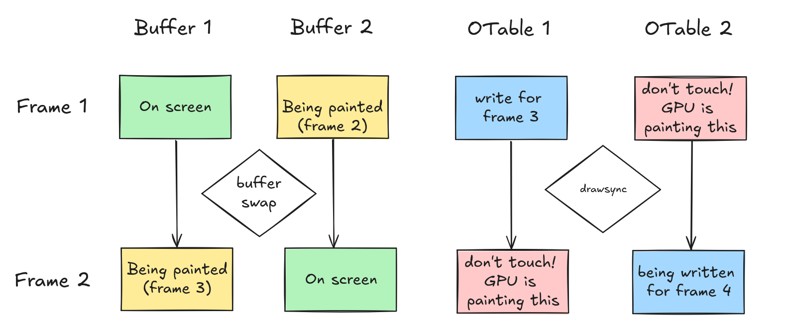

# Notris: a PlayStation 1 Tetris clone

Notris is a `suspiciously familiar' block puzzle game for the original PSOne. It was written in 2024 using modern tooling
and [PSNoobSDK](https://github.com/Lameguy64/PSn00bSDK).

(picture)

## Why write a PSX game in 2024?

Last year I managed to get my hands on a very rare, black PlayStation 1 unit. This is called a Net Yaroze and was a Sony
project to get hobbyists and students into the games industry. It is a special console that, as well as playing ordinary
PSX games, could play homebrew titles when connected to a PC.

Yaroze games were pretty limited as Sony didn't want hobbyists competing with commercial developers. They could
only be played on other Yarozes or as part of special demo discs (some were distributed by Official PlayStation Magazine -
learn more about this [here](https://www.breck-mckye.com/blog/2016/11/net-yaroze/)). They had to fit completely within
system RAM without access to the CD-ROM or memory card. But it was powerful enough to spring up a small community of
dedicated indie developers.

And now I had my own. It got me thinking: what was it actually like, to write a PlayStation game? Could I actually write
my own?

This is about how I wrote a simple homebrew PSX game myself, using an open-source version of the libraries but still
running on original hardware and written in classic C.

## PlayStation development in the 90s

_See also: https://www.retroreversing.com/official-playStation-devkit_

PSX games were typically written in C on Windows 9X workstations. The official devkit was a pair of ISA expansion cards
that slotted into a common IBM PC motherboard and contained the entire PSX system chipset, with extra RAM (8mb instead
of 2mb), and TTY plus debugger output to the host machine.

Enthusiasts might know about special blue debugging PlayStations. These were very close to retail units but could be
adapted into devkits using additional hardware. However, the ISA cards were the more usual setup.

The design was quite developer-friendly. You could play a game on CRT with retail controllers whilst stepping through
GDB breakpoints on your Windows 95 PC, leafing through a thick textbook of C SDK functions.

In principle, a PSX developer could work entirely in C. The SDK comprised a set of C libraries called PSY-Q, and
included a compiler program `ccpsx` that was really a frontend over GCC 2.9.5. This supported a range of optimisations, 
like code inlining and loop unrolling, although performance critical sections still warranted hand-optimised assembly.

(You can read about some of Sony's recommended optimisation in [these SCEE
conference slides](https://psx.arthus.net/sdk/Psy-Q/DOCS/CONF/SCEE/96April/optimize.pdf)).

C++ was supported by `ccpsx` but had a reputation for generating 'bloated' code, as well as slower compile times. Really
C was the lingua franca of PSX development, but some projects made use of dynamic scripting languages on top of a base
engine. _Metal Gear Solid_ embeds TCL scripts for level and entity behaviours, and the _Final Fantasy_ games implement
module-specific bytecode languages for battles, field and minigame systems. (You can learn about one example of this
[here](https://youtu.be/S-8PVydb9CM?si=oU0Rqy6bsd0EVq_F)).

## Taking this on ourselves

But I came to this from a very different perspective: a software engineer in 2024 who mostly worked on web applications.
My professional experience had almost exclusively been in high level languages like JavaScript and Haskell; I'd done a
little OpenGL work and C++, but modern C++ is practically a different language these days. I was treading on foreign
ground.

I knew there more modern PSX SDKs existed for languages like Rust, but I still wanted to experience the flavour of 'real'
PSX programming the way it had been done back in the 90s. At the same time I didn't want to be stuck using a Windows95
emulator and DOSBox to run a toolchain from thirty years ago.

I figured I'd need to break this down into three steps:

1. Create a prototype in a high level language
2. Port the code into C on Mac / Linux / PC
3. Pick a PSX toolchain, and port the game to PlayStation

I didn't want my game to by fancy; I wanted something 2D that could be prototyped in a couple of days. In the end I
settled for a Tetris clone - I figured that would be complex _enough_ to experience what I wanted to experience.

## High level prototype

(Picture)

Working in a familiar, user-friendly language would allow me to get to grips with my design and the overall logic. I
chose JavaScript: it's simple, fairly concise, and easy to debug. HTML5 `<canvas>` provides an easy 2D graphics API. I 
got to work and had fun tweaking the feel and mechanics of my game.

At the same time, I had to take care not to trap  myself with a high-level programming style - if I used language 
features like first-class functions or OOP, I knew I'd struggle to translate the code into plain old C. I needed to be 
disciplined and only use a subset of JS features that resembled my target language: simple structs, homogenous arrays, 
plain loops, and as little dynamic memory as possible.

## Learning C

So I actually had an ulterior motive taking on this project: it was an excuse to finally learn C. The language loomed
large in my mind and I'd begun to develop an inferiority complex over not knowing it.

C has an intimidating reputation and I feared horror stories of dangling pointers, misaligned reads and the dreaded
`segmentation fault: core dumped`. More pertinently: I was worried that if I tried to learn C, and failed, I'd discover
that I wasn't actually a very good programmer after all. There was more than just a PSX hobby project on the line.

Few problems resist iteration. All I needed was to break down the steps. If I could find a very simple cross-platform
C graphics library, I could focus on just the core logic and exploring the new language. If I targeted a modern desktop
OS, the game would be easy to debug and I'd learn from language mistakes quicker. That's why I chose to write phase 2
for MacOS with [Simple DirectMedia Layer (SDL2)](http://www.libsdl.org/).

Despite my fears, I found working in C incredibly fun. Very quickly I found it 'clicked' for me. You start from a set of
very simple primitives - structs, chars, functions - and build them up as layers of abstraction to eventually find
yourself in an entire working system. It does require some discipline and clarity to avoid the footguns - it's not a
language that tolerates imprecision - but there is something very empowering about it, knowing every part of the system was
something you constructed personally.

(Picture)

The MacOS game took a few days to port, and I was very satisfied with my first C project. And I hadn't had a single
segfault!

SDL had been a pleasure to work with, but there were a few aspects that required me to allocate memory dynamically.
This would be a no-no on the PlayStation, where the `malloc` provided by the PSX kernel doesn't even work properly.
And the graphics pipeline would be a new experience entirely...

## Hello, PSX!

Choosing an sdk, tradeoffs. link to installation instructions

starting with something basic - two bounding squares

### A primer on PSX graphics

graphics pipeline is quite different

every time you want to draw, you hand the GPU a linked list of pointers to 'primitives' / graphics commands. It traverses
this in reverse order, from the end of the list to the start. Therefore shapes are drawn from highest z coordinate (furthest
away) to lowest, implementing the painters algorithm

This work has to be synchronised with screen draws - vsync

The gpu can do this at the same time the CPU is working. therefore psx games generally have two primitives buffers and
two ordering tables, building one whilst drawing the other

### Taking control

how pads work
no input filtering

### Milestone: bouncing squares

getting to point of simple graphics and controls

## Making a UI...

I had all key pieces prototyped. now I just needed to combine them to implement my tetris clone

first step is the text and overall UI. this had been easy in SDL where I could just load in a front. the psx would be
much more hands on

there is a debug font, but it's not very good. instead I created a texture using the TIM format and timtool. a few
details about this

(Picture)

I also wanted a 'frame' for the play pieces to fall into. I wanted this to be more colourful than a plain white square
the psx supports nice color gradients. I made each corner the colour of a face button

(Picture)

I then started drawing the Tetronimos. These are made of multiple triangles and a quad. On an upscaling emulator they
look great. The actual rotations are hardcoded, where I treat 16 bit uints like a grid of 4x4 pixels. Then 4 uints 
encode all the rotations

on an upscaling emulator they look fantastic

(Picture, 1x resolution and 4x resolution)

## Something breaks

Testing tetronimos... black screen

(Picture)

Break down the problem - only when drawing many tetronimos
hunch: could this be to do with the primitives buffer?

(visualise how this would fail)

testing with printfs
fixing

(picture)

## Putting it together

I had the graphics and io, what about the logic
this was very easy to port. able to use a modern compiler with the same pragmas. not using vlas etc

one difference to know, is there is no malloc. psx malloc is broken. not much impact for me, as I'd deliberately
avoided dynamic memory

### Adding the SCEA logo

license data

(Picture)

### Emulator check

runs on emulator, 60fps even with speed restrictions. looks great with upscaling on

(Picture)

What would happen on an actual console?

## The moment of truth

this started with the yaroze purchase, but I wouldn't actually be playing this on yaroze
I wanted to actually compile a full, retail-equivalent playstation game, and run it on a grey console
Having lost my original PSX many years ago I scoured eBay for a model with the ability to play backup discs

burning PSX games is quite tricky these days. oxides, reflectivity, drives. It took some jiggery pokery to get my 
grey playstation finally booting a backup disc. The only way I could get the console to play my games was if I held it
on its side. Good enough

...
